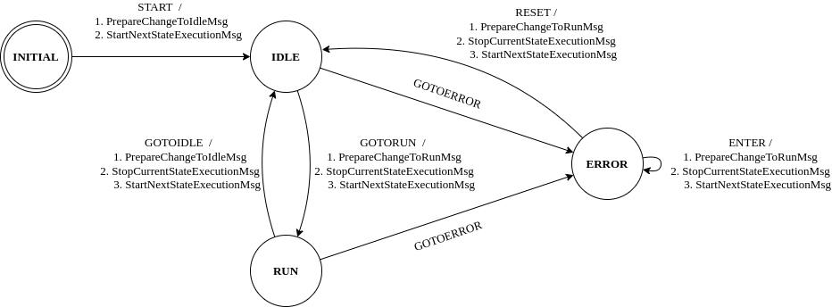

# StateMachine

- The **StateMachine** is a key component which is used in many MARTe applications to synchronise the application state against the external environment.

- The **StateMachine** can be in one and only one state at a given time.

- Each state contains one, or more, **StateMachineEvent** elements.

``` cpp
+StateMachine = {
    Class = StateMachine
    +STATE1 = {
        Class = ReferenceContainer
        +GOTOSTATE2 = {
            Class = StateMachineEvent
            ...
        }
        ...
        +GOTOERROR = {
            Class = StateMachineEvent
            ...
        }
    }
    +STATE2 = {
        Class = ReferenceContainer
        +GOTOSTATE1 = {
            Class = StateMachineEvent
            ...
        }
        ...
        +GOTOERROR = {
            Class = StateMachineEvent
            ...
        }
    }
    ...
    +ERROR ={
        Class = ReferenceContainer
        +ENTER = {
            Class = StateMachineEvent
            ...
        }
        ...
        +RESET = {
            Class = StateMachineEvent
            ...
        }
    }
}
```

- The **StateMachine** allows to associate the sending of **Messages** to **StateMachineEvents**.

- Upon receiving of a **Message**, the **StateMachine** will verify if the **Message** function is equal to the name of any of the declared **StateMachineEvent** elements for the current StateMachine state.
If it is, the **StateMachine** will change to the declared state and trigger any messages associated to this transition.

- Each **StateMachineEvent** contains:
    - `NextState` where to go
    - `NextStateError` where to go in case of any error
    - `Timeout` maximum amount of time allowed for the state transition (0 means an infinite time)
    - One or more **Messages** to send when thr event is triggered.<br>
      RealTimeState defines the following messages:
        - `PrepareNextState`: 
        - `StopCurrentStateExecution`: 
        - `StartNextStateExecution`: 

# Example



``` ini
+StateMachine = {
    Class = StateMachine
    +INITIAL = {
        Class = ReferenceContainer
        +START = {
            Class = StateMachineEvent
            NextState = IDLE
            NextStateError = ERROR
            Timeout = 0
            +PrepareChangeToIdleMsg = {
                Class = Message
                Destination = TestApp
                Mode = ExpectsReply
                Function = PrepareNextState
                +Parameters = {
                    Class = ConfigurationDatabase
                    param1 = Idle
                }
            }
            +StopCurrentStateExecutionMsg = {
                Class = Message
                Destination = TestApp
                Function = StopCurrentStateExecution
                Mode = ExpectsReply
            }
            +StartNextStateExecutionMsg = {
                Class = Message
                Destination = TestApp
                Function = StartNextStateExecution
                Mode = ExpectsReply
            }
        }
        +GOTOERROR = {
            Class = StateMachineEvent
            NextState = "ERROR"
            NextStateError = "ERROR"
        }
    }
    +IDLE = {
        Class = ReferenceContainer
        +GOTORUN = {
            Class = StateMachineEvent
            NextState = RUN
            NextStateError = ERROR
            Timeout = 0
            +PrepareChangeToRunMsg = {
                Class = Message
                Destination = TestApp
                Mode = ExpectsReply
                Function = PrepareNextState
                +Parameters = {
                    Class = ConfigurationDatabase
                    param1 = Run
                }
            }
            +StopCurrentStateExecutionMsg = {
                Class = Message
                Destination = TestApp
                Function = StopCurrentStateExecution
                Mode = ExpectsReply
            }
            +StartNextStateExecutionMsg = {
                Class = Message
                Destination = TestApp
                Function = StartNextStateExecution
                Mode = ExpectsReply
            }
        }
        +GOTOERROR = {
            Class = StateMachineEvent
            NextState = "ERROR"
            NextStateError = "ERROR"
        }
    }
    +RUN = {
        Class = ReferenceContainer
        +GOTOIDLE = {
            Class = StateMachineEvent
            NextState = IDLE
            NextStateError = ERROR
            Timeout = 0
            +PrepareChangeToIdleMsg = {
                Class = Message
                Destination = TestApp
                Mode = ExpectsReply
                Function = PrepareNextState
                +Parameters = {
                    Class = ConfigurationDatabase
                    param1 = Idle
                }
            }
            +StopCurrentStateExecutionMsg = {
                Class = Message
                Destination = TestApp
                Function = StopCurrentStateExecution
                Mode = ExpectsReply
            }
            +StartNextStateExecutionMsg = {
                Class = Message
                Destination = TestApp
                Function = StartNextStateExecution
                Mode = ExpectsReply
            }
        }
        +GOTOERROR = {
            Class = StateMachineEvent
            NextState = "ERROR"
            NextStateError = "ERROR"
        }
    }
    +ERROR = {
        Class = ReferenceContainer
        +ENTER =
            Class = ReferenceContainer
            +StopCurrentStateExecutionMsg = {
                Class = Message
                Destination = TestApp
                Function = StopCurrentStateExecution
                Mode = ExpectsReply
            }
            +PrepareChangeToErrorMsg = {
                Class = Message
                Destination = TestApp
                Mode = ExpectsReply
                Function = PrepareNextState
                +Parameters = {
                    Class = ConfigurationDatabase
                    param1 = Error
                }
            }
            +StartNextStateExecutionMsg = {
                Class = Message
                Destination = TestApp
                Function = StartNextStateExecution
                Mode = ExpectsReply
            }
        }
        +RESET = {
            Class = StateMachineEvent
            NextState = IDLE
            NextStateError = IDLE
            Timeout = 0
            +StopCurrentStateExecutionMsg = {
                Class = Message
                Destination = TestApp
                Function = StopCurrentStateExecution
                Mode = ExpectsReply
            }
            +PrepareChangeToIdleMsg = {
                Class = Message
                Destination = TestApp
                Mode = ExpectsReply
                Function = PrepareNextState
                +Parameters = {
                    Class = ConfigurationDatabase
                    param1 = Idle
                }
            }
            +StartNextStateExecutionMsg = {
                Class = Message
                Destination = TestApp
                Function = StartNextStateExecution
                Mode = ExpectsReply
        }
    }
}
```
